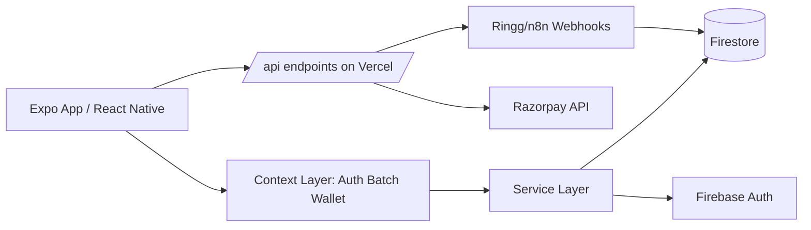
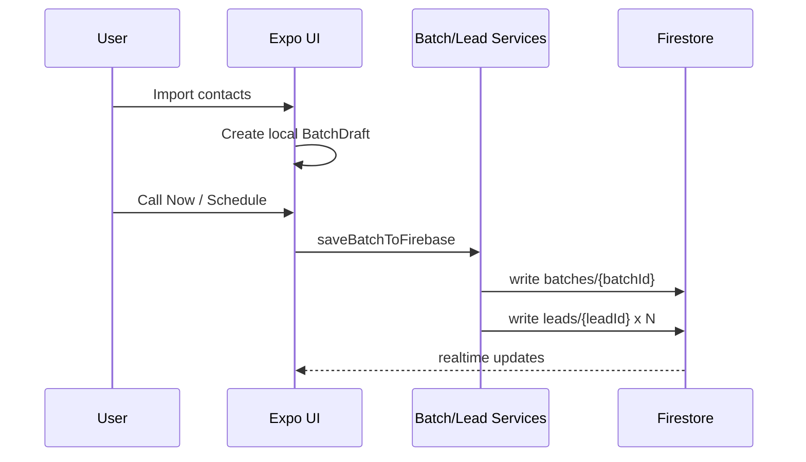
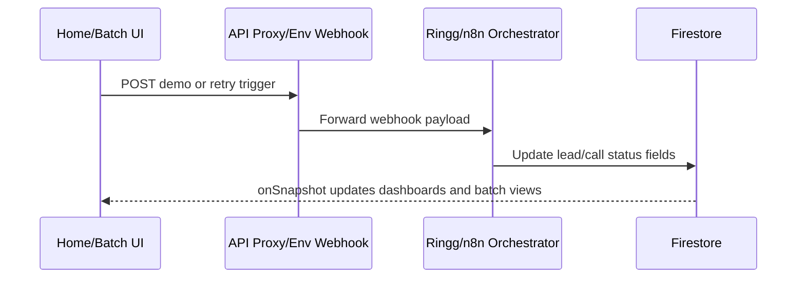
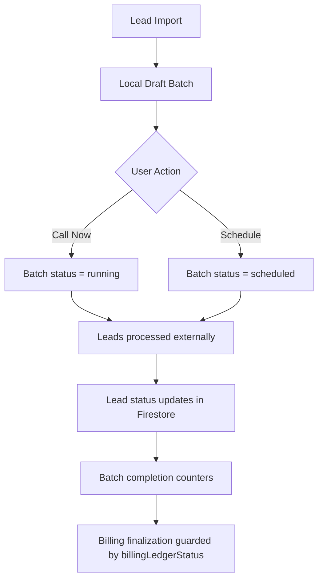

# Maxsas-AI Complete Architecture Audit

Date: 2026-03-08  
Scope: Full repository architecture review (Expo client, Firebase/Firestore, API layer, automation integrations, billing, security, scalability)

---

## 1. PROJECT STRUCTURE

### 1.1 Repository Tree (architecture-relevant)

```text
Maxsas-AI/
|-- app/
|   |-- _layout.tsx
|   |-- index.tsx
|   |-- login.tsx
|   |-- signup.tsx
|   |-- imports.tsx
|   |-- upload-leads.tsx
|   |-- attach-file.tsx
|   |-- image-import.tsx
|   |-- paste-leads.tsx
|   |-- batch-dashboard.tsx
|   |-- batch-detail.tsx
|   |-- batch-results.tsx
|   |-- batch-charges.tsx
|   |-- batch-billing-detail.tsx
|   |-- follow-up-schedule.tsx
|   |-- scheduled-follow-ups.tsx
|   |-- payment-history.tsx
|   |-- transaction-history.tsx
|   |-- settings.tsx
|   |-- feedback.tsx
|   |-- demo-transcript.tsx
|   |-- lead/
|   |   `-- [id].tsx
|   |-- (auth)/
|   |   `-- _layout.tsx
|   |-- (onboarding)/
|   |   |-- _layout.tsx
|   |   |-- name.tsx
|   |   `-- contact.tsx
|   `-- (tabs)/
|       |-- _layout.tsx
|       |-- index.tsx
|       |-- leads.tsx
|       |-- wallet.tsx
|       |-- notifications.tsx
|       |-- reports.tsx
|       |-- profile.tsx
|       |-- add-lead.tsx
|       `-- explore.tsx
|
|-- src/
|   |-- components/
|   |   `-- ...ui, pricing, shared widgets
|   |-- config/
|   |   |-- pricing.ts
|   |   `-- featureFlags.ts
|   |-- context/
|   |   |-- AuthContext.tsx
|   |   |-- BatchContext.tsx
|   |   `-- WalletContext.tsx
|   |-- data/
|   |-- examples/
|   |-- features/
|   |   |-- auth/
|   |   |-- dashboard/
|   |   |-- home/
|   |   |-- leads/
|   |   |-- payments/
|   |   |-- wallet/
|   |   |-- settings/
|   |   `-- ...
|   |-- hooks/
|   |   |-- useDashboardStats.ts
|   |   |-- usePricing.ts
|   |   |-- useGoogleAuth.ts
|   |   `-- useForgotPassword.ts
|   |-- lib/
|   |   |-- firebase.ts
|   |   |-- leadSchema.ts
|   |   |-- leadService.ts
|   |   |-- importHelpers.ts
|   |   |-- importServices.ts
|   |   `-- phoneExtractor.ts
|   |-- services/
|   |   |-- batchService.ts
|   |   |-- leadService.ts
|   |   |-- walletService.ts
|   |   |-- ledgerService.ts
|   |   |-- pricingService.ts
|   |   |-- systemService.ts
|   |   |-- userService.ts
|   |   |-- demoCallService.ts
|   |   |-- razorpayCheckoutService.ts
|   |   |-- notificationService.ts
|   |   `-- geminiExtractor.ts
|   |-- theme/
|   |-- types/
|   |   `-- batch.ts
|   `-- utils/
|
|-- api/
|   |-- proxy-demo.ts
|   |-- payments/
|   |   `-- razorpay/
|   |       |-- create-order.ts
|   |       |-- webhook.ts
|   |       |-- create-order.test.ts
|   |       `-- webhook.test.ts
|   `-- _lib/ (currently empty)
|
|-- docs/
|   |-- architecture/
|   |-- implementation/
|   |-- batch/
|   |-- firestore/
|   |-- schedule-call/
|   |-- testing/
|   |-- integrations/
|   `-- ...
|
|-- firestore.rules
|-- firestore.indexes.json
|-- firebase.json
|-- FIRESTORE_SECURITY_RULES_TESTS.ts
|-- app.json
|-- eas.json
|-- vercel.json
|-- package.json
`-- scripts/
```

### 1.2 Purpose of Major Folders

- `app/`: Expo Router route layer, screen entry points, navigation groups.
- `src/`: core domain/business implementation (services, context, types, hooks, feature UIs).
- `src/services/`: all business workflows (batch, leads, billing, user, runtime, notifications).
- `src/lib/`: low-level Firebase/integration utilities and import parsing.
- `src/context/`: global React providers/state (`Auth`, `Batch`, `Wallet`).
- `src/hooks/`: composable reactive data hooks (notably dashboard stats and pricing).
- `src/types/`: canonical domain contracts for batch/lead/wallet/runtime entities.
- `firebase` layer: no dedicated `/firebase` folder; Firebase is configured by root files and `src/lib/firebase.ts`.
- `src/utils/`: helper/test utility modules.
- `docs/`: architecture baselines, implementation notes, runbooks, investigations.

---

## 2. FRONTEND ARCHITECTURE

### 2.1 Routing System and expo-router Usage

- Router root in `app/_layout.tsx` uses `Stack` and wraps all screens with providers.
- Route groups:
	- `(auth)` for unauthenticated screens.
	- `(onboarding)` for profile completion.
	- `(tabs)` for main authenticated shell.
- Dynamic route: `app/lead/[id].tsx`.
- Root gate in `app/index.tsx` decides redirect by auth + profile completeness.

### 2.2 Authentication Flow

1. `AuthProvider` (`src/context/AuthContext.tsx`) subscribes to auth state.
2. If no user -> redirect to `/login` (or pass-based guest flow to tabs).
3. If user exists -> `isUserProfileComplete` check via `userService`.
4. Incomplete profile -> `/(onboarding)/name`; complete -> `/(tabs)`.

Firebase auth methods used:
- `signInWithEmailAndPassword`
- `createUserWithEmailAndPassword`
- `signOut`

### 2.3 Dashboard Screens and Lead/Batch Operations

- Home dashboard: `src/features/home/HomeScreen.tsx`
	- Uses `useDashboardStats` (real-time listeners on `batches` and `leads`).
	- Starts notification engine (`startOperationalNotificationEngine`).
	- Contains demo AI call UX + transcript flow.
- Batch dashboard: `src/features/leads/BatchDashboard.tsx`
	- Shows combined local drafts + Firebase batches from `BatchContext`.
	- Validates wallet balance before "Call Now".
- Batch detail/results:
	- `src/features/leads/BatchDetailScreen.tsx`
	- `src/features/leads/BatchResultsScreen.tsx`
	- Attach live lead listeners, retry filtering, and billing finalization guard.

### 2.4 Wallet UI

- `src/features/wallet/WalletScreen.tsx`
	- Real-time wallet and transaction feed via `WalletContext`.
	- Recharge triggers Razorpay checkout flow.
	- Shows available balance, locked amount, spend/recharge totals, recent history.

### 2.5 Settings/Profile

- Settings UI: `src/features/settings/SettingsScreen.tsx` (currently mostly presentational toggles).
- Profile screen route exists under tabs (`app/(tabs)/profile.tsx` -> feature module).

### 2.6 Important State Files

- `AuthProvider`: `src/context/AuthContext.tsx`
- `BatchProvider`: `src/context/BatchContext.tsx`
- `WalletProvider`: `src/context/WalletContext.tsx`

Global state management pattern:
- React Context + local component state.
- Firestore `onSnapshot` listeners for real-time synchronization.
- No Redux/Zustand/MobX present.

---

## 3. FIREBASE ARCHITECTURE

### 3.1 Authentication

- Client auth bootstrap and wrapper in `src/lib/firebase.ts`.
- Supports web Firebase Auth and native `@react-native-firebase/auth` via runtime branch.

### 3.2 Firestore Collections

#### `users`

- Schema (from `AuthContext`, `userService`, `types/batch.ts`):
	- `userId`, `email`, `displayName?`, `name?`, `phone?`
	- concurrency: `maxCurrentCalls`, `currentActiveCalls`, `tier`
	- demo flags: `demoEligible`, `demoUsed`, `hasSeenDemo`, `demoTranscriptViewed`, `demoCallId?`
	- timestamps: `createdAt`, `updatedAt`
- Relationship:
	- parent entity for `wallets/{userId}`, `users/{uid}/notifications`, and ownership of `batches/leads`.

#### `batches`

- Schema (from `batchService`, `types/batch.ts`):
	- identity/ownership: `batchId`, `userId`
	- orchestration: `status`, `action`, `source`, `processingLock`, `lockOwner`, `lockExpiresAt`, `priority`, `lastDispatchedAt`
	- counters: `totalContacts`, `runningCount`, `completedCount`, `failedCount`
	- lifecycle: `createdAt`, `updatedAt`, `scheduleAt`, `startedAt`, `completedAt`
	- billing analytics: `batchTotalCost`, `connectedCount`, `interestedCount`, `billingLedgerStatus`, `billedAt`
- Relationship:
	- one-to-many with `leads` via `lead.batchId`.

#### `leads`

- Schema (from `leadService`, `types/batch.ts`):
	- identity/ownership: `leadId`, `batchId`, `userId`, `phone`
	- status fields: `status`, `callStatus`, `aiDisposition`
	- retry fields: `attempts`, `maxAttempts`, `retryCount`, `nextRetryAt`, `lastAttemptAt`
	- call timing/provider: `callStartedAt`, `callEndedAt`, `providerCallId`, `callDuration`
	- lock/billing: `lockOwner`, `lockExpiresAt`, `billingStatus`, `callCost`, `minutesCharged`, `successFeeApplied`, `billedAt`
	- notes/audit: `notes`, `createdAt`, `lastActionAt`
- Relationship:
	- belongs to one `batch` and one `user`.

#### `wallets`

- Schema:
	- `userId`, `balance`, `lockedAmount`, `totalSpent`, `totalRecharged`, `updatedAt`
- Relationship:
	- one per user.
	- has subcollection `wallets/{userId}/transactions`.

#### `wallets/{userId}/transactions` (wallet transactions)

- Schema:
	- `transactionId`, `userId`, `type` (`recharge`, `deduction`, `batch_debit`, etc.)
	- `amount`, `previousBalance`, `newBalance`, `batchId?`, `description`, `createdAt`
- Relationship:
	- ledger visible to wallet UI.

#### `transactions` (global ledger)

- Used by `ledgerService` for lead/batch debit records.
- Client reads only own entries per rules.

#### `system/runtime` (system runtime)

- Schema (from `systemService`, `types/batch.ts`):
	- `activeCalls`, `maxAllowedCalls`, `ringgChannelLimit`, `dispatcherInstanceCount`, `maintenanceMode`, `updatedAt`
	- optional pricing object consumed by `pricingService`.

### 3.3 Indexes

Defined in `firestore.indexes.json`:
- collection group `transactions` indexes for:
	- `userId + createdAt DESC`
	- `userId + type + createdAt DESC`
	- `userId + batchId + type + createdAt DESC`

No explicit index entries for `batches`/`leads` in file (Firestore may use default single-field indexes unless composite needed later).

---

## 4. BATCH PROCESSING SYSTEM

### 4.1 Lifecycle

1. Lead import/intake:
	- From CSV, clipboard, image, manual routes under `app/imports.tsx`, `app/upload-leads.tsx`, etc.
2. Draft batch creation:
	- `BatchContext.createLocalBatch` creates local `BatchDraft` only (no Firestore write).
3. Batch submission:
	- `saveBatchToFirebase(batch, action, scheduleAt)` invoked from dashboard/detail flows.
4. Lead document creation:
	- `batchService` writes one `batches/{batchId}` doc.
	- Then `leadService.createLeadsForBatch` writes one lead doc per contact.
5. Status transitions:
	- Draft -> `running` (`call_now`) or `scheduled`.
	- `updateBatchStatus` can transition to `completed`/`failed` and trigger finalization logic.

### 4.2 Responsible Files

- Batch service: `src/services/batchService.ts`
- Lead service: `src/services/leadService.ts`
- Batch context/global state: `src/context/BatchContext.tsx`
- Dashboard listeners:
	- `BatchContext` (`subscribeToBatches`, `subscribeToLeadsForUser`)
	- `src/hooks/useDashboardStats.ts`

---

## 5. LEAD LIFECYCLE

### 5.1 Primary States

- `queued`: initial state after batch lead creation.
- `calling`: active/in-progress call processing.
- `completed`: terminal success or closed processing path.

Also present in current code model:
- `failed_retryable`, `failed_permanent`, and normalized `failed` handling in UI and services.

### 5.2 Where Status Changes Occur

- Initial creation: `src/services/leadService.ts` (`createLeadsForBatch`) -> `status: queued`.
- Generic mutation: `updateLeadStatus` in `src/services/leadService.ts`.
- Retry transitions: `updateRetrySchedule` in `src/services/leadService.ts`.
- Batch detail automation and retry UX updates: `src/features/leads/BatchDetailScreen.tsx`.
- External automation expected to update lead statuses through Firestore (n8n/dispatcher path).

---

## 6. N8N AUTOMATION

### 6.1 What Exists in Repository

- No direct n8n workflow JSON or dedicated n8n server code committed.
- Integration points exist as webhook URLs and Firestore data contracts.

Detected integration hooks:
- Demo call proxy endpoint to upstream webhook: `api/proxy-demo.ts` -> `/webhook/ringg-init`.
- Retry webhook config used in UI:
	- `EXPO_PUBLIC_RETRY_LEAD_WEBHOOK_URL` (from `.env.example`)
	- referenced in `src/features/leads/BatchDetailScreen.tsx`.

### 6.2 Retry Logic / Orchestration / Follow-up Scheduling

- Retry logic exists in-app service layer (`updateRetrySchedule`) and retry UI triggers (`BatchDetailScreen`).
- Follow-up scheduling UI exists (`FollowUpScheduleScreen`, `ScheduledFollowUpsScreen`).
- Call orchestration proper is externalized; repo assumes automation layer consumes Firestore and updates statuses.

### 6.3 Firestore + n8n Integration Pattern

Expected pattern (from implementation + docs + fields):
- n8n/automation reads from `batches` and `leads`.
- n8n writes lead outcomes (`status`, `callStatus`, `aiDisposition`, retries).
- front-end real-time listeners react to those writes immediately.

Conclusion: integration is data-contract-driven, not workflow-code-driven, in this repo.

---

## 7. AI CALLING INTEGRATION (RINGG)

### 7.1 Current Integration State

- Ringg integration is currently explicit for demo flow and inferred for production call channels.
- `api/proxy-demo.ts` proxies to hardcoded upstream: `https://165.22.222.202:5678/webhook/ringg-init`.
- `demoCallService.executeDemoCallFlow` triggers webhook and tracks `demoCalls` state.

### 7.2 Trigger Points

- Demo call API trigger:
	- `src/services/demoCallService.ts` -> `fetch(webhookUrl)`.
- Production retry trigger:
	- `BatchDetailScreen` calls configured retry webhook.

### 7.3 Requested Artifacts Check

- `agentId`: not found as active runtime field in current code paths.
- campaign upload: no direct campaign upload API implementation found.
- call start trigger: present for demo (`executeDemoCallFlow`) and batch `call_now` status transition.
- webhook handling:
	- outbound proxy in `api/proxy-demo.ts`
	- inbound call-status webhook endpoint not found in `api/`.

---

## 8. BILLING SYSTEM

### 8.1 Wallet Model

- Core wallet document: `wallets/{userId}` with `balance`, `lockedAmount`, `totalSpent`, `totalRecharged`.
- Available balance computed as `balance - lockedAmount` in `WalletContext`.

### 8.2 Costing and Deduction

- Base call pricing constant: `COST_PER_CALL = 14` in `src/services/walletService.ts`.
- Reservation flow:
	- `checkBalanceBeforeBatch`
	- `reserveBalanceForBatch`
- Settlement flow:
	- `finalizeBatchPayment` and `finalizeBatchBillingFromClient`.
	- `ledgerService.finalizeCompletedBatchBilling` provides deterministic ledger idempotency (`batch_debit_{batchId}`).

### 8.3 Transaction History

- Real-time wallet transactions from `wallets/{userId}/transactions`.
- Additional global ledger in `transactions` collection for reporting and batch-level financial audit.

### 8.4 Billing Enforcement Points

- Pre-call guard in `BatchDashboard` via `checkBalance`.
- Client-side finalization guard in both:
	- `BatchDetailScreen`
	- `BatchResultsScreen`
- Batch ledger state gate: `billingLedgerStatus` (`pending` -> `finalized`).

---

## 9. SECURITY

### 9.1 Firestore Rules Coverage

Source: `firestore.rules`

- Default deny policy.
- User isolation by `request.auth.uid` and owner checks.
- Collection-level constraints for valid status enums, ownership immutability, and critical field protection.
- `system/runtime` is read-only for clients and write-protected for automation.

### 9.2 User Isolation

- `users/{uid}` read/write limited to current user, with protected system fields.
- `batches` and `leads` reads limited to ownership (`userId` and `isBatchOwner`).
- Wallets and wallet transactions restricted per user.

### 9.3 Batch Ownership Validation

- `isBatchOwner(batchId)` helper enforces relation integrity.
- Lead create requires referenced batch existence and owner alignment.

### 9.4 Lead Ownership Validation

- Lead read/update/delete requires same `userId` or automation pathway.
- Update rules lock identity fields (`leadId`, `batchId`, `userId`, `createdAt`).

---

## 10. CONFIGURATION LAYER

### 10.1 API Keys / Environment Variables

- `.env.example` declares:
	- OAuth IDs (`EXPO_PUBLIC_*_CLIENT_ID`)
	- Demo webhook (`EXPO_PUBLIC_DEMO_CALL_WEBHOOK_URL`)
	- Retry webhook (`EXPO_PUBLIC_RETRY_LEAD_WEBHOOK_URL`)
	- Razorpay keys/secrets (`RAZORPAY_*`)
	- Firebase admin credentials (`FIREBASE_*`)

### 10.2 AI Provider Configuration

- Demo call webhook URL from env in `demoCallService`.
- Fallback on web through internal proxy `/api/proxy-demo`.
- Runtime struct includes `ringgChannelLimit` under `system/runtime`.

### 10.3 Cost Per Call Configuration

- Hardcoded `COST_PER_CALL = 14` in `walletService`.
- Separate pricing config (`connectedMinuteRate`, `qualifiedLeadRate`) in `pricingService` via `system/runtime.pricing` with defaults from `src/config/pricing.ts`.

---

## 11. SCALABILITY LIMITATIONS

### 11.1 Hardcoded Logic

- Hardcoded Firebase config in `src/lib/firebase.ts`.
- Hardcoded Ringg proxy upstream URL in `api/proxy-demo.ts`.
- Hardcoded `COST_PER_CALL` and some thresholds in wallet/notification logic.
- Rule helper `isAutomation()` returns `false`; automation is expected via Admin SDK bypass, not first-class tokenized role in rules.

### 11.2 Single-Tenant Assumptions

- Tenant key/partition absent from schemas (`users`, `batches`, `leads`, wallets).
- Queries are user-centric but not tenant-scoped.
- Feature/model config mostly global or hardcoded.

### 11.3 Tight Coupling

- UI screens directly trigger billing finalization in client side.
- Batch completion and billing behavior are coupled to front-end listeners.
- Service boundaries overlap (`src/lib/leadService.ts` and `src/services/leadService.ts` both exist, risk of drift).

### 11.4 Multi-client Break Risks

- Global runtime doc (`system/runtime`) is singleton; no tenant segmentation.
- Notification engine and dashboard listeners can become expensive with high lead volume per user.
- Lack of dedicated backend orchestration service in repo for production call-state reconciliation.

---

## 12. EXTENSIBILITY ANALYSIS

### 12.1 Multi-tenant SaaS

Current ease: Medium-Low.

Required:
- Add `tenantId` to all domain docs and rules.
- Introduce tenant-aware query guards and indexes.
- Partition runtime config (`system/{tenantId}/runtime` style).

### 12.2 Feature Flags

Current ease: Medium.

- `src/config/featureFlags.ts` exists, but central dynamic flag service not evident.
- Could be extended with remote config document per tenant/user tier.

### 12.3 Multiple AI Providers

Current ease: Medium.

- Webhook-based architecture is provider-pluggable conceptually.
- Need provider abstraction interface (e.g., `CallProviderAdapter`) and route/provider mapping.

### 12.4 Enterprise Custom Workflows

Current ease: Medium-Low.

- Data model supports status metadata, but orchestration is external/manual.
- Requires workflow engine contracts, event bus, and versioned automation templates.

### 12.5 Inventory Matching

Current ease: Medium.

- Could be added as new collection and enrichment stage keyed by lead and disposition.
- No current schema for inventory entities.

### 12.6 Project-Based Agents

Current ease: Medium-Low.

- No `agentId` runtime mapping in core batch/lead flow.
- Need project/campaign model with agent assignment and provider routing.

---

## 13. RISK AREAS

### 13.1 Performance

- Multiple broad real-time listeners (`leads` by user) can become heavy on large datasets.
- Client-side aggregations on entire lead sets can impact UI responsiveness.

### 13.2 Firestore Read Cost

- Home/dashboard and batch screens subscribe continuously.
- Notification engine subscribes to several collections simultaneously.
- Potential duplicated reads across tabs/screens if mounted concurrently.

### 13.3 n8n Dependency

- Core call processing status updates appear externalized.
- Limited in-repo visibility/ownership of orchestration logic.
- Operational risk if webhook endpoints/workflows degrade.

### 13.4 Provider Lock-in

- Razorpay and Ringg assumptions are embedded in service names/envs and endpoint shapes.
- Minimal abstraction layer for payment/call provider swap.

### 13.5 Consistency and Billing Risk

- Billing finalization currently has client-triggered paths.
- Idempotency exists (`billingLedgerStatus`, deterministic IDs), but server-authoritative settlement for batch billing would be safer at scale.

---

## 14. FINAL SUMMARY

### 14.1 System Architecture Diagram



### 14.2 Data Flow Diagram



### 14.3 AI Calling Flow Diagram



### 14.4 Batch Processing Flow Diagram



### 14.5 Audit Conclusion

- The codebase has a strong client-driven Firebase architecture with clear domain services and real-time dashboards.
- Firestore rules are relatively strict and ownership-aware.
- External automation (n8n/Ringg) is integrated via webhook contracts, but orchestration code is largely outside this repository.
- The biggest architecture upgrade path is moving to server-authoritative orchestration and tenant-aware data partitioning.

